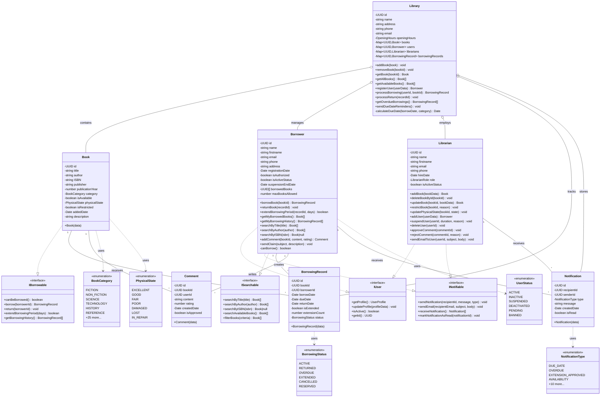

# 📐 Class Diagram - Library Management System

[← Retour UML](README.md)

---

## Diagramme de Classes Complet



---

## 📊 Analyse du Diagramme

### Interfaces (4)
- **IUser**: Contrat de base pour tous les utilisateurs
- **INotifiable**: Capacités de communication
- **ISearchable**: Capacités de recherche
- **IBorrowable**: Gestion des emprunts

### Enums (5 principales)
- **BookCategory**: 25 catégories de livres
- **PhysicalState**: 7 états physiques
- **BorrowingStatus**: 6 statuts d'emprunt
- **NotificationType**: 14 types de notifications
- **UserStatus**: 6 statuts utilisateur

### Models (4)
- **Book**: 15 attributs, représente un livre physique
- **BorrowingRecord**: 9 attributs, enregistrement d'emprunt
- **Comment**: 7 attributs, avis utilisateur
- **Notification**: 7 attributs, message système

### Domain Classes (3)
- **Borrower**: 27 méthodes publiques, implémente 3 interfaces
- **Librarian**: 33 méthodes publiques, implémente 2 interfaces
- **Library**: 12 méthodes publiques, coordinateur central

---

## 🔗 Relations Clés

### Implémentation d'Interfaces
```
Borrower → IUser + INotifiable + ISearchable
Librarian → IUser + INotifiable
Book → IBorrowable
```

### Associations
```
Book 1 ─── * BorrowingRecord
Borrower 1 ─── * BorrowingRecord
Book 1 ─── * Comment
Borrower 1 ─── * Comment
```

### Composition (Library est le conteneur)
```
Library ◆─── Book
Library ◆─── Borrower
Library ◆─── Librarian
Library ◆─── BorrowingRecord
```

---

## 🎯 Principes SOLID Illustrés

### Single Responsibility
Chaque classe a une responsabilité unique:
- Book: Représente un livre
- Borrower: Gère les emprunts utilisateur
- Library: Orchestre le système

### Interface Segregation
Interfaces petites et focalisées:
- IUser: 4 méthodes (profil de base)
- INotifiable: 4 méthodes (communication)
- ISearchable: 5 méthodes (recherche)

### Dependency Inversion
Les classes dépendent d'abstractions (interfaces), pas de concrétions.

---

[← Retour UML](README.md) | [ER Diagram →](02-er-diagram.md)
