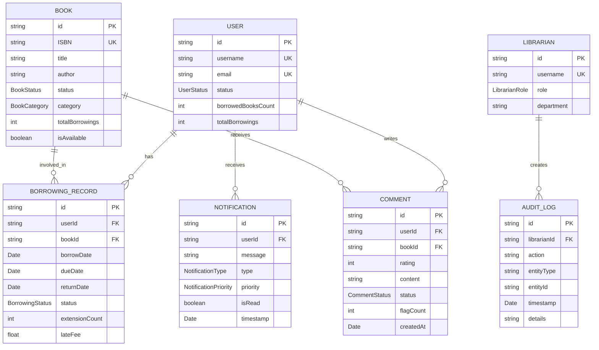
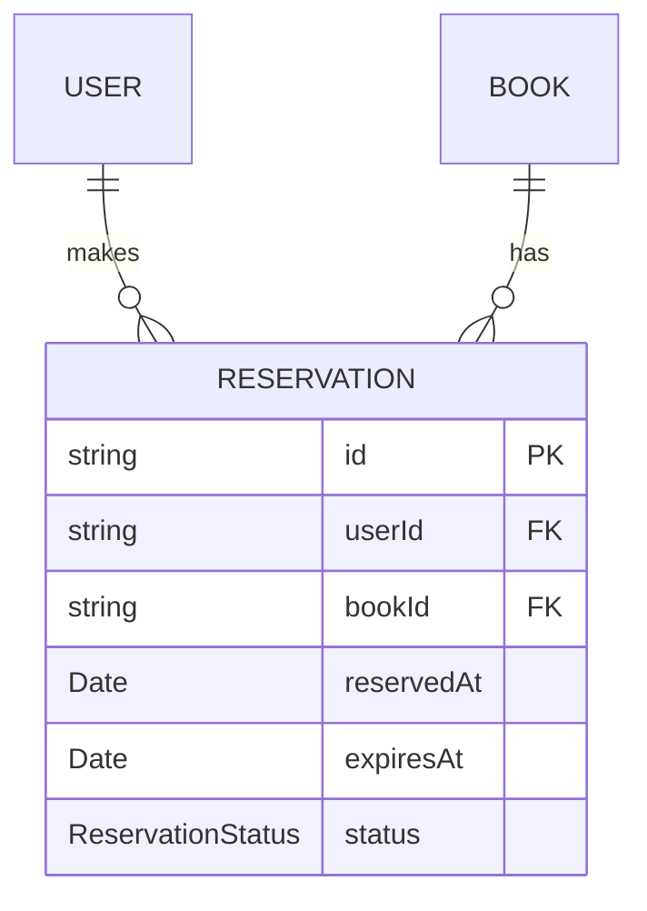
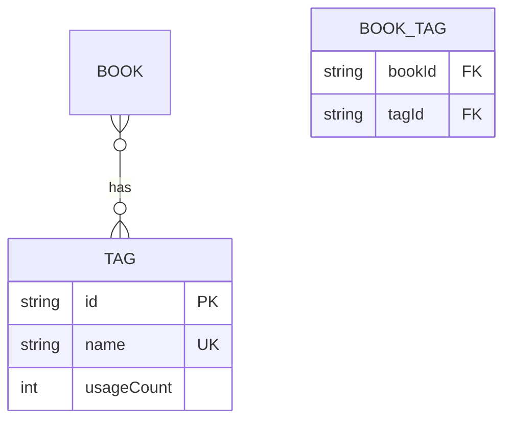
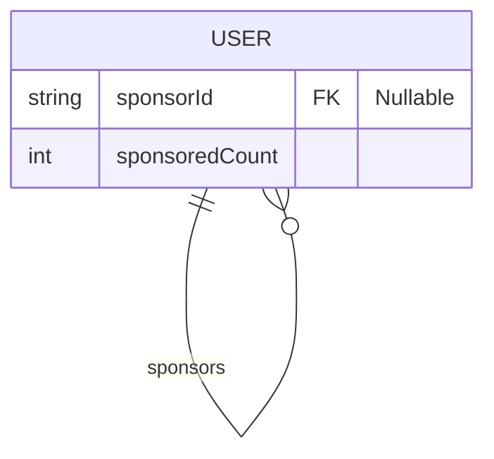

# 🗂️ Entity-Relationship Diagram

[← Retour UML](README.md) | [Class Diagram →](01-class-diagram.md)

---

## Diagramme ER du Système

Ce diagramme illustre les entités principales et leurs relations avec cardinalités.



---

## 📐 Cardinalités Détaillées

### USER ↔ BORROWING_RECORD
**Relation**: `1:N` (Un utilisateur peut avoir plusieurs emprunts)

**Contraintes**:
```typescript
// Limite simultanée
user.borrowedBooks.length <= BORROWING_POLICIES.MAX_BOOKS_PER_USER // 5

// Historique illimité
user.borrowingHistory.length >= 0 // Pas de limite
```

**Règles métier**:
- Un utilisateur ACTIVE peut emprunter jusqu'à 5 livres simultanément
- Un utilisateur SUSPENDED ne peut pas créer de nouveaux emprunts
- Les emprunts RETURNED restent en historique indéfiniment

---

### BOOK ↔ BORROWING_RECORD
**Relation**: `1:N` (Un livre peut être emprunté plusieurs fois)

**Contraintes**:
```typescript
// Un seul emprunt actif par livre
book.activeBorrowings = borrowingRecords.filter(
  r => r.status === ACTIVE || r.status === RESERVED
).length <= 1

// Historique total
book.totalBorrowings >= 0 // Métrique statistique
```

**Règles métier**:
- Un livre peut avoir UN SEUL emprunt actif (ACTIVE/RESERVED) à la fois
- Un livre REFERENCE ne peut jamais avoir d'emprunt actif
- Un livre LOST ne peut plus être emprunté

---

### USER ↔ COMMENT
**Relation**: `1:N` (Un utilisateur peut écrire plusieurs commentaires)

**Contraintes**:
```typescript
// Un seul commentaire par livre et par utilisateur
user.comments.filter(c => c.bookId === bookId).length <= 1

// Commentaires actifs illimités
user.activeComments.length >= 0
```

**Règles métier**:
- Un utilisateur ne peut écrire qu'UN SEUL commentaire par livre
- Peut modifier son commentaire à tout moment (si APPROVED)
- Peut supprimer son propre commentaire

---

### BOOK ↔ COMMENT
**Relation**: `1:N` (Un livre peut recevoir plusieurs commentaires)

**Contraintes**:
```typescript
// Pas de limite sur nombre de commentaires
book.comments.length >= 0

// Rating moyen calculé
book.averageRating = sum(comments.filter(APPROVED).rating) / count(APPROVED)
```

**Règles métier**:
- Seuls les commentaires APPROVED sont visibles
- Commentaires FLAGGED masqués automatiquement si flagCount >= 3
- Rating doit être entre 1 et 5 étoiles

---

### USER ↔ NOTIFICATION
**Relation**: `1:N` (Un utilisateur reçoit plusieurs notifications)

**Contraintes**:
```typescript
// Pas de limite théorique
user.notifications.length >= 0

// Archivage automatique
if (notification.age > 90 && notification.isRead) {
  archiveNotification(notification.id);
}
```

**Règles métier**:
- Notifications URGENT envoyées par email également
- Notifications non lues affichées en badge (max 99+)
- Suppression automatique après 90 jours si lues

---

### LIBRARIAN ↔ AUDIT_LOG
**Relation**: `1:N` (Un bibliothécaire crée plusieurs logs)

**Contraintes**:
```typescript
// Conservation indéfinie
auditLogs.retentionPeriod = UNLIMITED

// Tous les logs signés
auditLog.librarianId !== null
auditLog.timestamp !== null
```

**Règles métier**:
- Toute action de bibliothécaire est loggée
- Logs immuables (aucune suppression possible)
- Actions critiques requièrent double validation

---

## 🔗 Relations Implicites (Non Modélisées)

### USER ↔ BOOK (via Favoris)
**Relation potentielle**: `N:M` (Many-to-Many)

```typescript
// Table de jonction possible
USER_FAVORITES {
  userId: string FK
  bookId: string FK
  addedAt: Date
}
```

### BOOK ↔ CATEGORY (via Enum)
**Relation actuelle**: Enum simple

**Alternative N:M possible**:
```typescript
// Pour tags multiples
BOOK_CATEGORIES {
  bookId: string FK
  category: BookCategory
}

// Permet: book.categories = [FICTION, ROMANCE, BESTSELLER]
```

---

## 📊 Statistiques de Relations

### Volume de Données (Exemple bibliothèque moyenne)

| Entité | Volume | Ratio/User |
|--------|--------|------------|
| USER | 1,000 | 1.0 |
| BOOK | 5,000 | 5.0 |
| BORROWING_RECORD | 25,000 | 25.0 |
| COMMENT | 3,000 | 3.0 |
| NOTIFICATION | 50,000 | 50.0 |
| AUDIT_LOG | 100,000 | 100.0 |

### Relations les Plus Actives

```
USER → NOTIFICATION:     1:50  (50 notifications/user en moyenne)
USER → BORROWING:        1:25  (25 emprunts historiques/user)
BOOK → BORROWING:        1:5   (5 emprunts/livre en moyenne)
USER → COMMENT:          1:3   (3 commentaires/user)
```

---

## 🎯 Contraintes d'Intégrité Référentielle

### Cascade DELETE

```typescript
// Suppression utilisateur (rare)
ON DELETE USER CASCADE:
  - BORROWING_RECORD (archivés, pas supprimés)
  - COMMENT (anonymisés, pas supprimés)
  - NOTIFICATION (supprimés)
```

### Cascade UPDATE

```typescript
// Changement userId (très rare)
ON UPDATE USER.id:
  - BORROWING_RECORD.userId
  - COMMENT.userId
  - NOTIFICATION.userId
```

### Contraintes CHECK

```typescript
// BORROWING_RECORD
CHECK (borrowDate <= dueDate)
CHECK (returnDate IS NULL OR returnDate >= borrowDate)
CHECK (extensionCount >= 0 AND extensionCount <= 2)
CHECK (lateFee >= 0 AND lateFee <= 50)

// COMMENT
CHECK (rating >= 1 AND rating <= 5)
CHECK (content.length >= 10 AND content.length <= 1000)

// USER
CHECK (borrowedBooksCount >= 0 AND borrowedBooksCount <= 5)
```

---

## 🔍 Index Recommandés

### Performance Optimization

```sql
-- Recherche emprunts actifs par utilisateur
CREATE INDEX idx_borrowing_user_status 
ON BORROWING_RECORD(userId, status);

-- Recherche livres disponibles
CREATE INDEX idx_book_status_category 
ON BOOK(status, category, isAvailable);

-- Recherche commentaires par livre
CREATE INDEX idx_comment_book_status 
ON COMMENT(bookId, status);

-- Recherche notifications non lues
CREATE INDEX idx_notification_user_read 
ON NOTIFICATION(userId, isRead, timestamp DESC);

-- Audit logs par bibliothécaire
CREATE INDEX idx_audit_librarian_timestamp 
ON AUDIT_LOG(librarianId, timestamp DESC);
```

---

## 🚀 Évolutions Possibles

### Relations Additionnelles

#### 1. Système de Réservation (N:M)


#### 2. Système de Tags (N:M)


#### 3. Système de Parrainages (1:N)


---

[Class Diagram →](01-class-diagram.md) | [Retour UML](README.md)
