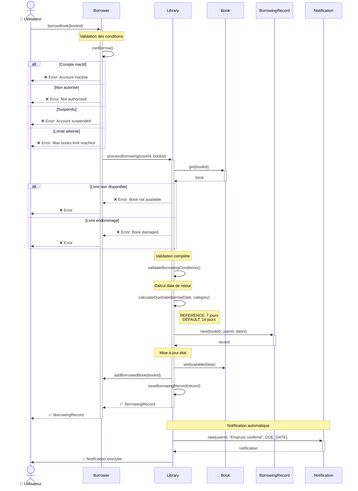
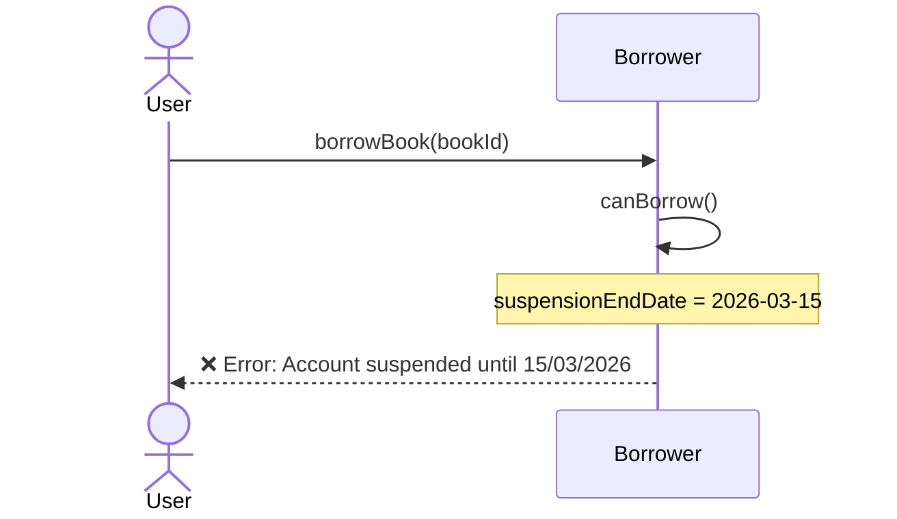
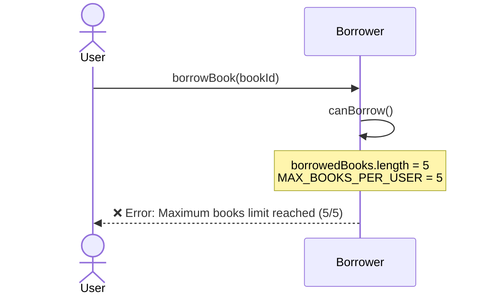
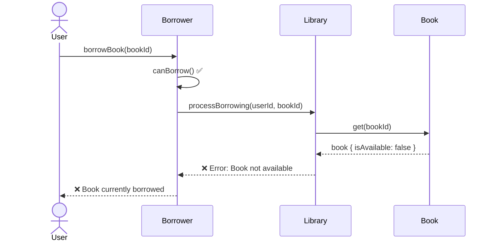

# 📖 Borrowing Sequence Diagram

[← Retour UML](README.md) | [← Class Diagram](01-class-diagram.md)

---

## Workflow d'Emprunt de Livre

Ce diagramme illustre le processus complet d'emprunt d'un livre par un utilisateur.



---

## 📋 Étapes Détaillées

### 1. Validation Utilisateur (Borrower.canBorrow())

```typescript
private canBorrow(): boolean {
  return this.isActiveStatus
    && this.isAuthorized
    && this.suspensionEndDate === null
    && this.borrowedBooks.length < BORROWING_POLICIES.MAX_BOOKS_PER_USER;
}
```

**Vérifications**:
- ✅ Compte actif (`isActiveStatus = true`)
- ✅ Autorisé à emprunter (`isAuthorized = true`)
- ✅ Non suspendu (`suspensionEndDate = null`)
- ✅ Limite de livres non atteinte (< 5 par défaut)

### 2. Validation Livre (Library.processBorrowing())

**Vérifications**:
- ✅ Livre existe
- ✅ Livre disponible (`isAvailable = true`)
- ✅ Livre non restreint (`isRestricted = false`)
- ✅ État physique acceptable (`!= DAMAGED, LOST, IN_REPAIR`)

### 3. Calcul Date de Retour

```typescript
private calculateDueDate(borrowDate: Date, category: BookCategory): Date {
  const days = category === BookCategory.REFERENCE
    ? TIME_POLICIES.REFERENCE_BORROWING_PERIOD  // 7 jours
    : TIME_POLICIES.DEFAULT_BORROWING_PERIOD;   // 14 jours
  
  return addDays(borrowDate, days);
}
```

### 4. Création BorrowingRecord

```typescript
{
  id: UUID,
  bookId: UUID,
  borrowerId: UUID,
  borrowDate: new Date(),
  dueDate: calculatedDate,
  returnDate: null,
  extensionCount: 0,
  status: BorrowingStatus.ACTIVE
}
```

### 5. Mise à Jour État

**Modifications effectuées**:
```typescript
// Livre
book.isAvailable = false;

// Utilisateur
borrower.borrowedBooks.push(bookId);

// Système
library.borrowingRecords.set(record.id, record);
```

### 6. Notification

**Notification immédiate**:
```typescript
{
  type: NotificationType.DUE_DATE,
  message: "Livre emprunté avec succès. À retourner avant le DD/MM/YYYY",
  recipientId: userId
}
```

---

## 🔄 Scénarios Alternatifs

### Échec: Compte Suspendu



### Échec: Limite de Livres Atteinte



### Échec: Livre Non Disponible



---

## ⏱️ Timing et Performance

| Étape | Temps estimé | Criticité |
|-------|--------------|-----------|
| Validation utilisateur | < 1ms | Haute |
| Récupération livre | < 5ms | Haute |
| Validation livre | < 1ms | Haute |
| Calcul date | < 1ms | Moyenne |
| Création record | < 5ms | Haute |
| Mise à jour état | < 10ms | Critique |
| Notification | Async | Basse |
| **TOTAL** | **< 25ms** | |

---

## 🎯 Business Rules Appliquées

```typescript
// Règles utilisées dans ce workflow
BORROWING_POLICIES.MAX_BOOKS_PER_USER = 5
TIME_POLICIES.DEFAULT_BORROWING_PERIOD = 14  // jours
TIME_POLICIES.REFERENCE_BORROWING_PERIOD = 7 // jours
ACCESS_POLICIES.MIN_ACCOUNT_AGE_DAYS = 1
```

---

## 📊 États Modifiés

### Avant l'Emprunt
```
Book:
  isAvailable: true

Borrower:
  borrowedBooks: [book1, book2]  // 2 livres

BorrowingRecord:
  N/A
```

### Après l'Emprunt
```
Book:
  isAvailable: false

Borrower:
  borrowedBooks: [book1, book2, book3]  // 3 livres

BorrowingRecord:
  {
    status: ACTIVE,
    dueDate: borrowDate + 14 jours,
    extensionCount: 0
  }
```

---

[← Class Diagram](01-class-diagram.md) | [Retour UML](README.md) | [Return Sequence →](04-return-sequence.md)
