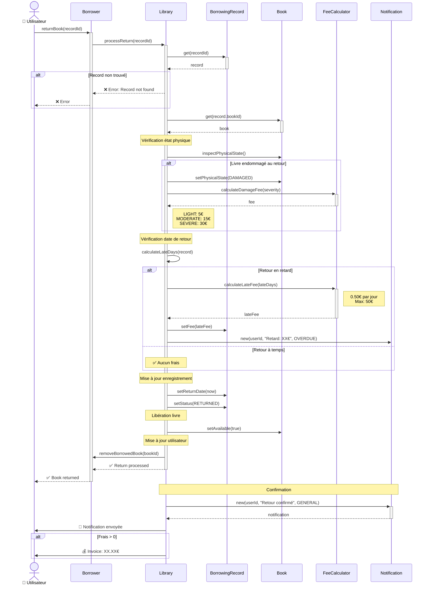

# ↩️ Return Sequence Diagram

[← Retour UML](README.md) | [← Borrowing](03-borrowing-sequence.md)

---

## Workflow de Retour de Livre

Ce diagramme illustre le processus de retour d'un livre emprunté.



---

## 📋 Étapes Détaillées

### 1. Récupération de l'Enregistrement

```typescript
const record = this.borrowingRecords.get(recordId);
if (!record) {
  throw new Error('Borrowing record not found');
}
if (record.status !== BorrowingStatus.ACTIVE) {
  throw new Error('Book already returned');
}
```

### 2. Inspection Physique du Livre

**Vérification de l'état au retour**:
```typescript
enum DamageSeverity {
  NONE = "none",
  LIGHT = "light",      // Pages cornées, petites taches
  MODERATE = "moderate", // Couverture abîmée, pages déchirées
  SEVERE = "severe"      // Livre inutilisable
}
```

**Frais de dommage**:
```typescript
const DAMAGE_FEES = {
  LIGHT: 5.00,
  MODERATE: 15.00,
  SEVERE: 30.00
};
```

### 3. Calcul des Frais de Retard

```typescript
function calculateLateFee(record: BorrowingRecord): number {
  const now = new Date();
  
  if (now <= record.dueDate) {
    return 0; // À temps
  }
  
  const lateDays = Math.floor(
    (now.getTime() - record.dueDate.getTime()) / (1000 * 60 * 60 * 24)
  );
  
  // Application période de grâce
  const daysCharged = Math.max(0, lateDays - FEE_POLICIES.LATE_FEE_GRACE_PERIOD);
  
  // Calcul avec plafond
  const fee = Math.min(
    daysCharged * FEE_POLICIES.LATE_FEE_PER_DAY,
    FEE_POLICIES.MAX_LATE_FEE
  );
  
  return fee;
}
```

**Exemple**:
```
lateDays = 10 jours
gracePeriod = 1 jour
daysCharged = 10 - 1 = 9 jours
fee = min(9 × 0.50€, 50€) = 4.50€
```

### 4. Mise à Jour de l'État

**Modifications effectuées**:
```typescript
// BorrowingRecord
record.returnDate = new Date();
record.status = BorrowingStatus.RETURNED;
record.lateFee = calculatedFee; // Si applicable

// Book
book.isAvailable = true;

// Borrower
borrower.borrowedBooks = borrower.borrowedBooks.filter(
  id => id !== record.bookId
);
```

---

## 🔄 Scénarios de Retour

### Scénario 1: Retour À Temps + Bon État

```
Emprunt: 01/02/2026
Due Date: 15/02/2026
Retour: 14/02/2026 (J-1)
État: EXCELLENT

Résultat:
✅ Aucun frais
✅ Livre disponible immédiatement
📧 Notification: "Merci pour votre retour à temps!"
```

### Scénario 2: Retour en Retard

```
Emprunt: 01/02/2026
Due Date: 15/02/2026
Retour: 25/02/2026 (J+10)
État: GOOD

Calcul:
lateDays = 10
gracePeriod = 1
daysCharged = 9
fee = 9 × 0.50€ = 4.50€

Résultat:
⚠️ Frais de retard: 4.50€
✅ Livre disponible
📧 Notification: "Livre retourné avec 10 jours de retard. Frais: 4.50€"
```

### Scénario 3: Retour avec Dommages

```
Emprunt: 01/02/2026
Due Date: 15/02/2026
Retour: 10/02/2026 (à temps)
État: MODERATE damage

Résultat:
💰 Frais de dommage: 15.00€
⚠️ Livre marqué DAMAGED (non disponible)
📧 Notification: "Livre retourné endommagé. Frais: 15.00€"
📧 Notification au bibliothécaire: "Livre #123 retourné endommagé"
```

### Scénario 4: Retard + Dommages

```
Emprunt: 01/02/2026
Due Date: 15/02/2026
Retour: 25/02/2026 (J+10)
État: LIGHT damage

Calcul:
lateFee = 9 × 0.50€ = 4.50€
damageFee = 5.00€
totalFee = 9.50€

Résultat:
💰 Total: 9.50€
⚠️ Livre DAMAGED
📧 Notification: "Retard (10j) + Dommages. Frais: 9.50€"
```

---

## 📊 États Modifiés

### Avant le Retour
```
BorrowingRecord:
  status: ACTIVE
  returnDate: null
  dueDate: 15/02/2026

Book:
  isAvailable: false

Borrower:
  borrowedBooks: [book1, book2, book3]
```

### Après le Retour
```
BorrowingRecord:
  status: RETURNED
  returnDate: 14/02/2026
  lateFee: 0.00€

Book:
  isAvailable: true

Borrower:
  borrowedBooks: [book1, book2]
```

---

## ⚡ Actions Automatiques Post-Retour

### 1. Notifications Utilisateurs en Attente

Si des utilisateurs sont abonnés aux notifications de disponibilité:
```typescript
for (const subscriber of bookSubscribers) {
  sendNotification(
    subscriber.id,
    `Le livre "${book.title}" est maintenant disponible!`,
    NotificationType.AVAILABILITY
  );
}
```

### 2. Mise à Jour des Statistiques

```typescript
// Statistiques livre
book.totalBorrows++;
book.lastBorrowed = record.returnDate;

// Statistiques utilisateur
borrower.borrowingHistory.push(record);
borrower.totalBorrowsCompleted++;
if (lateFee > 0) {
  borrower.lateReturnsCount++;
}
```

### 3. Alertes Automatiques

```typescript
// Alerte si retard important
if (lateDays > 30) {
  notifyLibrarian(
    `User #${borrower.id} returned book ${lateDays} days late`,
    NotificationType.OVERDUE
  );
}

// Alerte si dommages sévères
if (damageLevel === DamageSeverity.SEVERE) {
  notifyLibrarian(
    `Book #${book.id} returned with severe damage`,
    NotificationType.GENERAL
  );
  // Possible suspension automatique
  if (WORKFLOW_POLICIES.AUTO_SUSPEND_ON_SEVERE_DAMAGE) {
    suspendUser(borrower.id, 7, "Severe book damage");
  }
}
```

---

## 🎯 Business Rules Appliquées

```typescript
FEE_POLICIES.LATE_FEE_PER_DAY = 0.50         // €/jour
FEE_POLICIES.MAX_LATE_FEE = 50.00            // € max
FEE_POLICIES.LATE_FEE_GRACE_PERIOD = 1       // jour
FEE_POLICIES.DAMAGED_BOOK_FEE_LIGHT = 5.00   // €
FEE_POLICIES.DAMAGED_BOOK_FEE_MODERATE = 15.00
FEE_POLICIES.DAMAGED_BOOK_FEE_SEVERE = 30.00
```

---

## 📈 Métriques de Retour

| Métrique | Calcul | Usage |
|----------|--------|-------|
| Taux de retour à temps | `onTimeReturns / totalReturns` | KPI qualité |
| Frais moyens | `sum(fees) / totalReturns` | Revenus |
| Taux de dommages | `damagedReturns / totalReturns` | Qualité service |
| Délai moyen retard | `sum(lateDays) / lateReturns` | Analyse comportement |

---

[← Borrowing](03-borrowing-sequence.md) | [Retour UML](README.md) | [Borrowing States →](06-borrowing-states.md)
