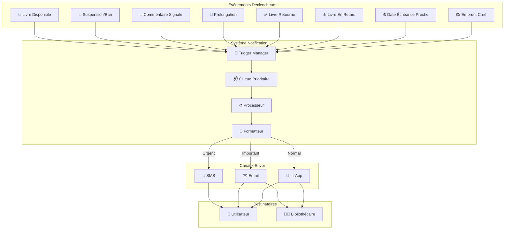
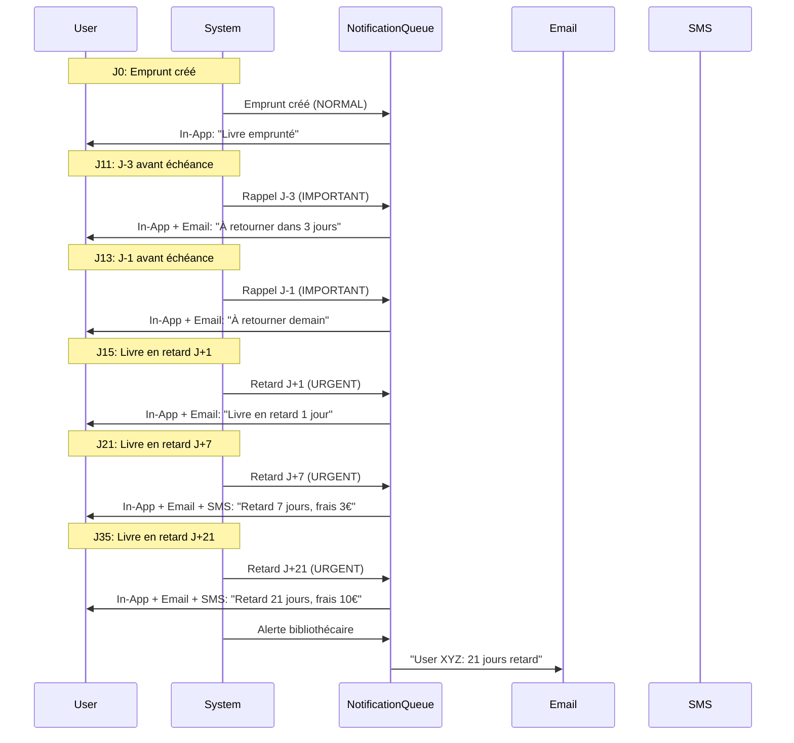

# 🔔 Notification Flow Diagram

[← Retour UML](README.md) | [← ER Diagram](02-er-diagram.md)

---

## Flux de Notifications Automatiques

Ce diagramme illustre le système de notifications automatiques et leurs déclencheurs.



---

## 📋 Types de Notifications et Priorités

### 1. 📚 Emprunt Créé (NORMAL)

**Déclencheur**:
```typescript
borrowBook(userId, bookId) → NotificationType.GENERAL
```

**Message**:
```
"Vous avez emprunté «${book.title}». À retourner avant le ${dueDate}."
```

**Canaux**: In-App uniquement  
**Priorité**: `NotificationPriority.NORMAL`  
**Délai**: Immédiat (< 1s)

---

### 2. ⏰ Date Échéance Proche (IMPORTANT)

**Déclencheurs** (Tâche CRON quotidienne):
```typescript
// J-3
if (dueDate - now === 3 days) {
  sendNotification(
    userId,
    "Rappel: «${book.title}» à retourner dans 3 jours",
    NotificationType.REMINDER,
    NotificationPriority.IMPORTANT
  );
}

// J-1
if (dueDate - now === 1 day) {
  sendNotification(
    userId,
    "Rappel: «${book.title}» à retourner demain",
    NotificationType.REMINDER,
    NotificationPriority.IMPORTANT
  );
}
```

**Canaux**: In-App + Email  
**Priorité**: `NotificationPriority.IMPORTANT`  
**Délai**: Chaque matin à 8h00

---

### 3. ⚠️ Livre En Retard (URGENT)

**Déclencheur** (Tâche CRON quotidienne):
```typescript
if (now > dueDate && status !== RETURNED) {
  const lateDays = calculateLateDays(now, dueDate);
  const lateFee = calculateLateFee(lateDays);
  
  sendNotification(
    userId,
    `⚠️ Livre en retard de ${lateDays} jour(s): «${book.title}». Frais: ${lateFee}€`,
    NotificationType.OVERDUE,
    NotificationPriority.URGENT
  );
}
```

**Canaux**: In-App + Email + SMS (si > 7 jours)  
**Priorité**: `NotificationPriority.URGENT`  
**Fréquence**: J+1, J+7, J+14, J+30

---

### 4. ✅ Livre Retourné (NORMAL)

**Déclencheur**:
```typescript
returnBook(recordId) → NotificationType.GENERAL

// Sans frais
"Merci d'avoir retourné «${book.title}»."

// Avec frais
"Livre retourné: «${book.title}». Frais de retard: ${lateFee}€."

// Avec dommages
"Livre retourné avec dommages (${severity}). Frais: ${damageFee}€."
```

**Canaux**: In-App + Email (si frais)  
**Priorité**: `NORMAL` ou `IMPORTANT` (si frais > 10€)

---

### 5. 🔄 Prolongation (NORMAL)

**Déclencheurs**:

#### Prolongation Approuvée
```typescript
extendBorrowingPeriod(recordId, 7) → success

"Prolongation approuvée: nouveau retour le ${newDueDate}."
```

#### Prolongation Refusée
```typescript
extendBorrowingPeriod(recordId, 7) → error

"Prolongation refusée: livre réservé par un autre utilisateur."
"Prolongation refusée: limite de 2 prolongations atteinte."
"Prolongation refusée: livre déjà en retard."
```

**Canaux**: In-App  
**Priorité**: `NORMAL`

---

### 6. 📝 Commentaire Signalé (IMPORTANT)

**Déclencheur**:
```typescript
flagComment(commentId, reason) → NotificationType.GENERAL

// Vers auteur du commentaire
if (flagCount >= FLAG_POLICIES.AUTO_HIDE_THRESHOLD) {
  sendNotification(
    comment.userId,
    "Votre commentaire a été masqué pour modération (signalements multiples).",
    NotificationType.GENERAL,
    NotificationPriority.IMPORTANT
  );
}

// Vers bibliothécaire modérateur
sendNotification(
  moderatorId,
  "Commentaire signalé ${flagCount}× sur «${book.title}» - nécessite modération",
  NotificationType.GENERAL,
  NotificationPriority.IMPORTANT
);
```

**Canaux**: In-App + Email (bibliothécaire)  
**Priorité**: `IMPORTANT`

---

### 7. 👤 Suspension/Ban (URGENT)

**Déclencheurs**:

#### Suspension
```typescript
suspendUser(userId, duration, reason)

"⛔ Votre compte a été suspendu pour ${duration} jours. Raison: ${reason}"
```

#### Bannissement
```typescript
banUser(userId, reason)

"🚫 Votre compte a été banni définitivement. Raison: ${reason}"
```

**Canaux**: In-App + Email + SMS  
**Priorité**: `URGENT`  
**Délai**: Immédiat

---

### 8. 📖 Livre Disponible (IMPORTANT)

**Déclencheur**:
```typescript
returnBook(recordId) → if (book.hasReservation)

// Vers premier utilisateur en file d'attente
sendNotification(
  nextUserId,
  "Le livre «${book.title}» est maintenant disponible. Vous avez 24h pour le retirer.",
  NotificationType.GENERAL,
  NotificationPriority.IMPORTANT
);
```

**Canaux**: In-App + Email  
**Priorité**: `IMPORTANT`  
**Expiration**: 24h (sinon réservation suivante)

---

## ⚙️ Processeur de Notifications

### Architecture de la Queue

```typescript
class NotificationQueue {
  private urgentQueue: Notification[] = [];
  private importantQueue: Notification[] = [];
  private normalQueue: Notification[] = [];
  
  enqueue(notification: Notification): void {
    switch (notification.priority) {
      case NotificationPriority.URGENT:
        this.urgentQueue.push(notification);
        break;
      case NotificationPriority.IMPORTANT:
        this.importantQueue.push(notification);
        break;
      default:
        this.normalQueue.push(notification);
    }
    
    this.processNext();
  }
  
  private processNext(): void {
    const next = 
      this.urgentQueue.shift() ||
      this.importantQueue.shift() ||
      this.normalQueue.shift();
      
    if (next) {
      this.send(next);
    }
  }
  
  private async send(notification: Notification): Promise<void> {
    // In-App: toujours
    await this.sendInApp(notification);
    
    // Email: si IMPORTANT ou URGENT
    if (notification.priority !== NotificationPriority.NORMAL) {
      await this.sendEmail(notification);
    }
    
    // SMS: si URGENT uniquement
    if (notification.priority === NotificationPriority.URGENT) {
      await this.sendSMS(notification);
    }
  }
}
```

---

## 📊 Statistiques de Notifications

### Volume Quotidien (Bibliothèque 1000 users)

| Type | Volume/jour | Priorité | Canaux |
|------|-------------|----------|--------|
| Emprunt créé | ~50 | Normal | In-App |
| Rappel J-3 | ~40 | Important | In-App + Email |
| Rappel J-1 | ~40 | Important | In-App + Email |
| Livre en retard | ~10 | Urgent | In-App + Email + SMS |
| Livre retourné | ~45 | Normal | In-App |
| Prolongation | ~15 | Normal | In-App |
| Commentaire signalé | ~2 | Important | In-App + Email |
| Suspension/Ban | ~1 | Urgent | In-App + Email + SMS |
| Livre disponible | ~5 | Important | In-App + Email |

**Total**: ~200 notifications/jour

---

## 🎯 Règles de Filtrage

### Préférences Utilisateur

```typescript
interface NotificationPreferences {
  enableInApp: boolean;              // Default: true
  enableEmail: boolean;              // Default: true
  enableSMS: boolean;                // Default: false
  
  muteDuringHours: [number, number]; // Ex: [22, 8] = silence 22h-8h
  muteWeekends: boolean;             // Default: false
  
  emailDigest: 'realtime' | 'daily' | 'weekly'; // Default: realtime
}
```

### Règles de Consolidation

```typescript
// Éviter spam: groupe notifications similaires
if (user.notifications.filter(
  n => n.type === type && n.timestamp > now - 1hour
).length > 3) {
  // Envoyer digest au lieu de multiples
  sendDigestNotification(user, type, notifications);
}
```

---

## 🔍 Cas d'Usage Complet

### Scénario: Emprunt avec Retard



---

## 🚀 Améliorations Futures

### Push Notifications Mobile
```typescript
enablePushNotifications(userId, deviceToken) {
  // FCM (Firebase Cloud Messaging) ou APNs (Apple)
  sendPushNotification(deviceToken, notification);
}
```

### Webhooks Tiers
```typescript
enableWebhook(userId, webhookUrl) {
  // Intégration Slack, Discord, etc.
  sendWebhook(webhookUrl, notification);
}
```

### Notifications Intelligentes
```typescript
// ML: prédit meilleur moment d'envoi
const optimalTime = predictOptimalSendTime(userId, notification);
scheduleNotification(notification, optimalTime);
```

---

[← ER Diagram](02-er-diagram.md) | [Retour UML](README.md)
