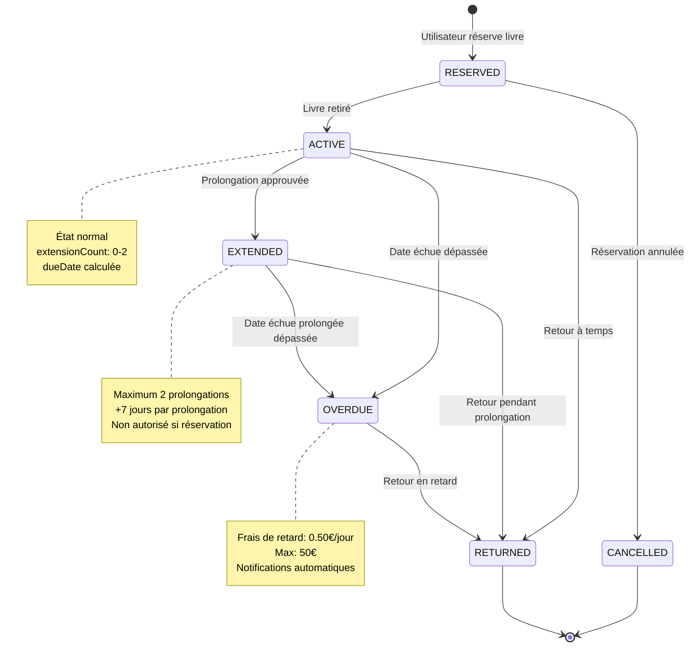

# 🔄 Borrowing State Diagram

[← Retour UML](README.md) | [← Return Sequence](04-return-sequence.md)

---

## Machine à États d'un Emprunt

Ce diagramme illustre tous les états possibles d'un enregistrement d'emprunt et les transitions entre eux.



---

## 📋 Description des États

### RESERVED (Réservé)
**Description**: Livre réservé mais pas encore retiré.

**Attributs**:
```typescript
{
  status: BorrowingStatus.RESERVED,
  borrowDate: null,
  dueDate: null,
  returnDate: null,
  extensionCount: 0
}
```

**Conditions**:
- Livre disponible mais mis de côté
- Utilisateur notifié (24h pour retirer)
- Expiration automatique après X jours

**Actions possibles**:
- ✅ Retirer → ACTIVE
- ❌ Annuler → CANCELLED
- ⏱️ Expiration auto → CANCELLED

---

### ACTIVE (En cours)
**Description**: Emprunt actif en cours.

**Attributs**:
```typescript
{
  status: BorrowingStatus.ACTIVE,
  borrowDate: Date,
  dueDate: borrowDate + 14 jours (ou 7 pour REFERENCE),
  returnDate: null,
  extensionCount: 0
}
```

**Conditions**:
- Livre emprunté
- Date de retour non dépassée
- Pas encore prolongé ou prolongé < 2 fois

**Actions possibles**:
- ✅ Retourner → RETURNED
- ✅ Prolonger → EXTENDED (si conditions OK)
- ⏱️ Date dépassée → OVERDUE (automatique quotidienne)

**Notifications automatiques**:
- J-3: "Rappel: livre à retourner dans 3 jours"
- J-1: "Rappel: livre à retourner demain"

---

### EXTENDED (Prolongé)
**Description**: Emprunt prolongé une ou deux fois.

**Attributs**:
```typescript
{
  status: BorrowingStatus.EXTENDED,
  borrowDate: Date,
  dueDate: dueDate + 7 jours × extensionCount,
  returnDate: null,
  extensionCount: 1 ou 2
}
```

**Conditions de prolongation**:
```typescript
canExtend = 
  extensionCount < BORROWING_POLICIES.MAX_EXTENSION_COUNT // < 2
  && !isOverdue
  && !hasReservation
  && WORKFLOW_POLICIES.AUTO_APPROVE_EXTENSION_IF_NO_RESERVATION;
```

**Limites**:
- Maximum 2 prolongations
- +7 jours par prolongation
- Non autorisé si livre réservé
- Non autorisé si déjà en retard

**Actions possibles**:
- ✅ Retourner → RETURNED
- ✅ Prolonger à nouveau → EXTENDED (si extensionCount < 2)
- ⏱️ Date dépassée → OVERDUE

---

### OVERDUE (En retard)
**Description**: Livre non retourné à la date d'échéance.

**Attributs**:
```typescript
{
  status: BorrowingStatus.OVERDUE,
  borrowDate: Date,
  dueDate: Date (dépassée),
  returnDate: null,
  extensionCount: 0-2,
  lateFee: calculatedFee
}
```

**Calcul des frais**:
```typescript
lateDays = now - dueDate (en jours)
daysCharged = max(0, lateDays - GRACE_PERIOD) // Grace: 1 jour
lateFee = min(
  daysCharged × 0.50€,
  50€  // Plafond
)
```

**Notifications automatiques**:
- J+1: "Votre livre est en retard de 1 jour"
- J+7: "Votre livre est en retard de 7 jours. Frais: 3.00€"
- J+14: "Votre livre est en retard de 14 jours. Frais: 6.50€"
- J+30: "Votre livre est en retard de 30 jours. Frais: 14.50€"

**Actions automatiques**:
```typescript
if (lateDays >= 30) {
  // Suspension automatique possible
  if (WORKFLOW_POLICIES.AUTO_SUSPEND_ON_THIRD_OVERDUE && user.overdueCount >= 3) {
    suspendUser(userId, 7, "Multiple overdue books");
  }
}
```

**Actions possibles**:
- ✅ Retourner → RETURNED (avec frais)
- ❌ Prolonger → Refusé

---

### RETURNED (Retourné)
**Description**: Livre retourné, emprunt terminé.

**Attributs**:
```typescript
{
  status: BorrowingStatus.RETURNED,
  borrowDate: Date,
  dueDate: Date,
  returnDate: Date,
  extensionCount: 0-2,
  lateFee: 0 ou calculatedFee
}
```

**Finalisation**:
- Livre redevient disponible
- Frais calculés et enregistrés
- Statistiques mises à jour
- Enregistrement archivé (après 3 ans)

**État final**: Aucune action possible

---

### CANCELLED (Annulé)
**Description**: Réservation annulée avant retrait.

**Attributs**:
```typescript
{
  status: BorrowingStatus.CANCELLED,
  borrowDate: null,
  dueDate: null,
  returnDate: null,
  cancellationReason: string
}
```

**Raisons**:
- Annulation utilisateur
- Expiration réservation (non retiré sous 24h)
- Livre devenu indisponible (perdu, endommagé)

**État final**: Aucune action possible

---

## 🔄 Transitions Détaillées

### Transition: ACTIVE → EXTENDED

**Événement**: `extendBorrowingPeriod(recordId, 7)`

**Préconditions**:
```typescript
✅ record.status === ACTIVE
✅ record.extensionCount < 2
✅ now <= record.dueDate  // Pas en retard
✅ !book.hasReservation
```

**Effets**:
```typescript
record.status = BorrowingStatus.EXTENDED;
record.extensionCount++;
record.dueDate = addDays(record.dueDate, 7);

sendNotification(
  userId,
  "Prolongation approuvée: nouveau retour le DD/MM/YYYY",
  NotificationType.EXTENSION_APPROVED
);
```

---

### Transition: ACTIVE → OVERDUE

**Événement**: Tâche planifiée quotidienne (CRON)

**Préconditions**:
```typescript
✅ record.status === ACTIVE || EXTENDED
✅ now > record.dueDate
```

**Effets**:
```typescript
record.status = BorrowingStatus.OVERDUE;

const lateDays = calculateLateDays(now, record.dueDate);
record.lateFee = calculateLateFee(lateDays);

sendNotification(
  userId,
  `Livre en retard de ${lateDays} jour(s). Frais: ${record.lateFee}€`,
  NotificationType.OVERDUE
);
```

---

### Transition: OVERDUE → RETURNED

**Événement**: `returnBook(recordId)`

**Préconditions**:
```typescript
✅ record.status === OVERDUE
```

**Effets**:
```typescript
record.status = BorrowingStatus.RETURNED;
record.returnDate = new Date();

// Frais déjà calculés dans l'état OVERDUE
const totalFee = record.lateFee;

book.isAvailable = true;
user.borrowedBooks.remove(bookId);

sendNotification(
  userId,
  `Livre retourné. Frais de retard: ${totalFee}€`,
  NotificationType.GENERAL
);

// Enregistrement facture
createInvoice(userId, totalFee, "Late return fee");
```

---

## 📊 Statistiques par État

### Distribution typique

```
ACTIVE:     70%  ████████████████████
EXTENDED:   15%  ████
OVERDUE:    10%  ███
RETURNED:   95%  (cumulatif)
RESERVED:    3%  █
CANCELLED:   2%  █
```

### Durée moyenne par état

| État | Durée Moyenne | Durée Maximale |
|------|---------------|----------------|
| RESERVED | 0.5 jour | 3 jours |
| ACTIVE | 12 jours | 14 jours |
| EXTENDED | 18 jours | 28 jours (14+7+7) |
| OVERDUE | 8 jours | Illimité |

---

## 🎯 Business Rules par État

### ACTIVE
```typescript
TIME_POLICIES.DEFAULT_BORROWING_PERIOD = 14
TIME_POLICIES.REFERENCE_BORROWING_PERIOD = 7
TIME_POLICIES.REMINDER_DAYS_BEFORE_DUE = [3, 1]
```

### EXTENDED
```typescript
BORROWING_POLICIES.MAX_EXTENSION_COUNT = 2
BORROWING_POLICIES.MAX_EXTENSION_DAYS = 7
WORKFLOW_POLICIES.AUTO_APPROVE_EXTENSION_IF_NO_RESERVATION = true
```

### OVERDUE
```typescript
FEE_POLICIES.LATE_FEE_PER_DAY = 0.50
FEE_POLICIES.MAX_LATE_FEE = 50.00
FEE_POLICIES.LATE_FEE_GRACE_PERIOD = 1
TIME_POLICIES.OVERDUE_NOTIFICATION_DAYS = [1, 7, 14, 30]
```

---

## 🔍 États Invalides / Impossibles

Ces transitions sont **interdites**:

```
❌ RETURNED → ACTIVE      (Pas de "ré-emprunt" du même record)
❌ OVERDUE → EXTENDED     (Prolongation refusée si en retard)
❌ CANCELLED → ACTIVE     (Réservation annulée ne peut devenir active)
❌ RETURNED → EXTENDED    (Déjà retourné)
```

---

[← Return Sequence](04-return-sequence.md) | [Retour UML](README.md)
