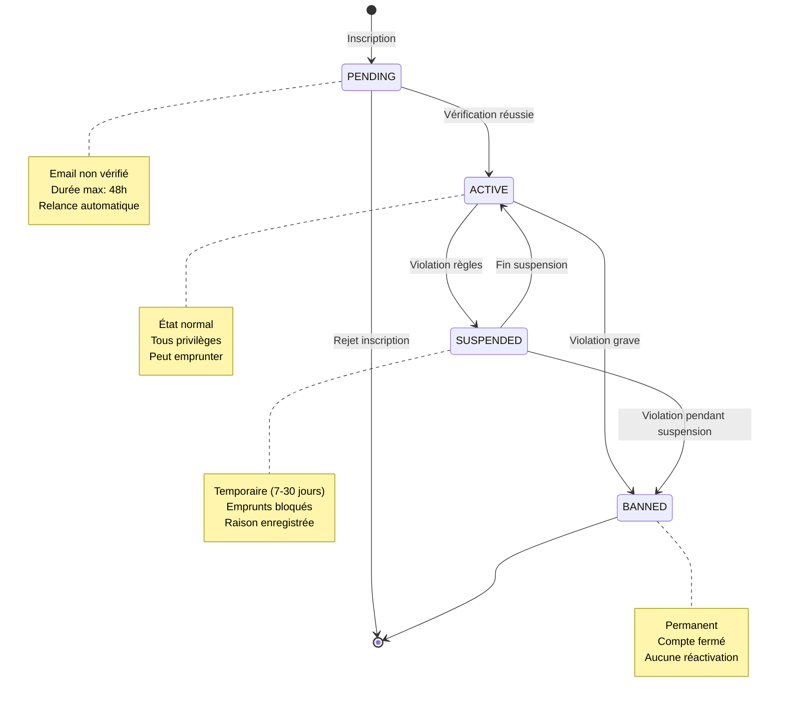

# 👤 User Status State Diagram

[← Retour UML](README.md) | [← Borrowing States](06-borrowing-states.md)

---

## Machine à États du Statut Utilisateur

Ce diagramme illustre les différents états du compte utilisateur et les transitions entre eux.



---

## 📋 Description des États

### PENDING (En attente)
**Description**: Utilisateur inscrit mais email non vérifié.

**Attributs**:
```typescript
{
  status: UserStatus.PENDING,
  registrationDate: Date,
  emailVerified: false,
  verificationToken: string,
  verificationExpiry: registrationDate + 48h
}
```

**Limitations**:
- ❌ Emprunter des livres
- ❌ Réserver des livres
- ❌ Écrire des commentaires
- ✅ Se connecter (lecture seule)
- ✅ Consulter le catalogue

**Actions automatiques**:
```typescript
// J+1: Relance email
if (!emailVerified && now > registrationDate + 24h) {
  sendVerificationReminder(userId);
}

// J+2: Suppression automatique
if (!emailVerified && now > verificationExpiry) {
  deleteAccount(userId);
}
```

---

### ACTIVE (Actif)
**Description**: Utilisateur vérifié avec tous les privilèges.

**Attributs**:
```typescript
{
  status: UserStatus.ACTIVE,
  registrationDate: Date,
  emailVerified: true,
  borrowedBooks: Book[],
  borrowingHistory: BorrowingRecord[]
}
```

**Privilèges**:
- ✅ Emprunter jusqu'à 5 livres simultanément
- ✅ Réserver des livres
- ✅ Prolonger 2× par emprunt
- ✅ Écrire/modifier commentaires
- ✅ Recevoir notifications
- ✅ Accès complet au catalogue

**Limites actives**:
```typescript
BORROWING_POLICIES.MAX_BOOKS_PER_USER = 5
BORROWING_POLICIES.MAX_EXTENSION_COUNT = 2
COMMENT_POLICIES.MIN_RATING = 1
COMMENT_POLICIES.MAX_RATING = 5
```

---

### SUSPENDED (Suspendu)
**Description**: Compte temporairement suspendu pour violation de règles.

**Attributs**:
```typescript
{
  status: UserStatus.SUSPENDED,
  suspensionStartDate: Date,
  suspensionEndDate: Date,
  suspensionReason: string,
  suspensionDuration: 7 | 14 | 30 // jours
}
```

**Raisons de suspension**:

#### 1. Retard Répété (Auto)
```typescript
if (user.overdueCount >= 3 && WORKFLOW_POLICIES.AUTO_SUSPEND_ON_THIRD_OVERDUE) {
  suspendUser(userId, 7, "3 retards répétés");
}
```

#### 2. Dommages Répétés (Manuel)
```typescript
// Par bibliothécaire
if (user.damageReportsCount >= 2) {
  librarian.suspendUser(userId, 14, "Dommages répétés aux livres");
}
```

#### 3. Abus de Commentaires (Manuel)
```typescript
if (comment.flagCount >= FLAG_POLICIES.AUTO_HIDE_THRESHOLD) {
  moderator.suspendUser(userId, 7, "Commentaires inappropriés signalés");
}
```

**Limitations**:
- ❌ Emprunter de nouveaux livres
- ❌ Réserver des livres
- ❌ Écrire de nouveaux commentaires
- ✅ Retourner livres actuels
- ✅ Consulter compte (lecture seule)
- ✅ Payer amendes

**Levée automatique**:
```typescript
// Tâche quotidienne
if (now >= user.suspensionEndDate && user.status === SUSPENDED) {
  user.status = UserStatus.ACTIVE;
  sendNotification(
    userId,
    "Votre compte a été réactivé",
    NotificationType.GENERAL
  );
}
```

---

### BANNED (Banni)
**Description**: Compte banni définitivement.

**Attributs**:
```typescript
{
  status: UserStatus.BANNED,
  banDate: Date,
  banReason: string,
  banAuthor: LibrarianId
}
```

**Raisons de bannissement**:

#### 1. Violations Répétées
```typescript
if (user.suspensionCount >= 3) {
  librarian.banUser(userId, "3 suspensions consécutives");
}
```

#### 2. Fraude / Abus Grave
```typescript
// Comportement malveillant détecté
librarian.banUser(userId, "Fraude sur emprunts multiples");
```

#### 3. Non-Paiement Prolongé
```typescript
if (user.totalUnpaidFees > 100 && lastPayment > 6months) {
  librarian.banUser(userId, "Non-paiement prolongé: 100€+");
}
```

**Conséquences**:
- ❌ Connexion refusée
- ❌ Toutes actions bloquées
- ⚠️ Livres actuellement empruntés à retourner immédiatement
- ⚠️ Amendes restantes dues
- 🚫 Aucune réactivation possible

---

## 🔄 Transitions Détaillées

### Transition: PENDING → ACTIVE

**Événement**: `verifyEmail(userId, token)`

**Préconditions**:
```typescript
✅ user.status === PENDING
✅ token === user.verificationToken
✅ now <= user.verificationExpiry
```

**Effets**:
```typescript
user.status = UserStatus.ACTIVE;
user.emailVerified = true;
user.verificationToken = null;

sendNotification(
  userId,
  "Bienvenue! Votre compte est activé",
  NotificationType.GENERAL
);

// Bonus utilisateur
if (WORKFLOW_POLICIES.WELCOME_BONUS_ENABLED) {
  user.borrowingLimit = 5; // Limite standard
}
```

---

### Transition: ACTIVE → SUSPENDED

**Événement**: `suspendUser(userId, duration, reason)`

**Préconditions**:
```typescript
✅ user.status === ACTIVE
✅ duration in [7, 14, 30]
✅ reason.length > 0
```

**Effets**:
```typescript
user.status = UserStatus.SUSPENDED;
user.suspensionStartDate = new Date();
user.suspensionEndDate = addDays(new Date(), duration);
user.suspensionReason = reason;
user.suspensionCount++;

// Annulation réservations actives
user.activeReservations.forEach(reservation => {
  cancelReservation(reservation.id);
});

sendNotification(
  userId,
  `Compte suspendu ${duration} jours: ${reason}`,
  NotificationType.URGENT
);

// Alerte bibliothécaire
logAuditEvent("USER_SUSPENDED", { userId, duration, reason });
```

---

### Transition: SUSPENDED → ACTIVE

**Événement**: Levée automatique ou manuelle anticipée

**Préconditions**:
```typescript
✅ user.status === SUSPENDED
✅ now >= user.suspensionEndDate OU librarian.unsuspend()
```

**Effets**:
```typescript
user.status = UserStatus.ACTIVE;
user.suspensionStartDate = null;
user.suspensionEndDate = null;
// suspensionCount conservé pour historique

sendNotification(
  userId,
  "Votre compte a été réactivé",
  NotificationType.GENERAL
);

// Log historique
logAuditEvent("USER_UNSUSPENDED", { userId, suspensionDuration });
```

---

### Transition: ACTIVE → BANNED

**Événement**: `banUser(userId, reason)` (bibliothécaire uniquement)

**Préconditions**:
```typescript
✅ user.status === ACTIVE || SUSPENDED
✅ caller.role === LibrarianRole.ADMIN || CHIEF
✅ reason.length >= 20 // Raison détaillée requise
```

**Effets**:
```typescript
user.status = UserStatus.BANNED;
user.banDate = new Date();
user.banReason = reason;
user.banAuthor = librarianId;

// Retour immédiat livres empruntés
user.borrowedBooks.forEach(borrowing => {
  if (borrowing.status !== RETURNED) {
    markAsLost(borrowing.id);
    // Frais maximum appliqués
  }
});

// Annulation toute activité
cancelAllReservations(userId);
deleteAllComments(userId); // Optionnel selon politique

sendNotification(
  userId,
  `Compte banni définitivement: ${reason}`,
  NotificationType.URGENT
);

// Audit critique
logAuditEvent("USER_BANNED", {
  userId,
  reason,
  authorId: librarianId,
  timestamp: new Date()
});
```

---

### Transition: SUSPENDED → BANNED

**Événement**: Violation pendant suspension

**Préconditions**:
```typescript
✅ user.status === SUSPENDED
✅ detectedViolation = true // Ex: tentative connexion multiple, menaces...
```

**Effets**: Identique à ACTIVE → BANNED, avec raison aggravée.

```typescript
banUser(
  userId,
  `Violation pendant suspension: ${violationType}. Banissement définitif.`
);
```

---

## 📊 Statistiques par État

### Distribution Utilisateurs

```
ACTIVE:     92%  ███████████████████████
SUSPENDED:   5%  ██
PENDING:     2%  ██
BANNED:      1%  █
```

### Durée Moyenne par État

| État | Durée Moyenne | Notes |
|------|---------------|-------|
| PENDING | 4 heures | 80% vérifient sous 12h |
| ACTIVE | Permanent | État par défaut |
| SUSPENDED | 10 jours | Médiane: 7 jours |
| BANNED | Permanent | État terminal |

---

## 🎯 Règles Métier par État

### Suspension Automatique
```typescript
WORKFLOW_POLICIES.AUTO_SUSPEND_ON_THIRD_OVERDUE = true
// 3 retards → 7 jours suspension automatique

SUSPENSION_DURATIONS = {
  FIRST_OFFENSE: 7,
  SECOND_OFFENSE: 14,
  THIRD_OFFENSE: 30
}
```

### Bannissement Manuel Uniquement
```typescript
BAN_REQUIRED_ROLE = LibrarianRole.ADMIN | CHIEF
BAN_MIN_REASON_LENGTH = 20
BAN_REQUIRES_SUPERVISOR_APPROVAL = true (si montant > 50€)
```

### Levée Anticipée (Grâce)
```typescript
// Bibliothécaire peut lever suspension si:
✅ user.suspensionReason !== "FRAUD"
✅ user.totalUnpaidFees === 0
✅ user.borrowedBooks.length === 0
✅ librarian.role === CHIEF
```

---

## 🚨 Événements Déclencheurs

### Vers SUSPENDED

| Événement | Seuil | Durée |
|-----------|-------|-------|
| 3ème retard | auto | 7 jours |
| 2ème dommage grave | manuel | 14 jours |
| Commentaire signalé 5× | auto | 7 jours |
| Fraude détectée | manuel | 30 jours |

### Vers BANNED

| Événement | Condition |
|-----------|-----------|
| 3 suspensions | auto-suggéré |
| Fraude prouvée | manuel |
| Non-paiement > 100€ + 6 mois | manuel |
| Menaces/violence | immédiat |

---

## 🔍 États Complémentaires (Non Implémentés)

États possibles pour évolutions futures:

### PROBATION (Probatoire)
État intermédiaire entre SUSPENDED et ACTIVE:
- Limite emprunt réduite (2 livres au lieu de 5)
- Pas de prolongation autorisée
- Durée: 30 jours post-suspension
- Transition auto vers ACTIVE si aucun incident

### VIP (Utilisateur Premium)
État spécial pour utilisateurs exemplaires:
- Limite emprunt augmentée (10 livres)
- Prolongation illimitée
- Priorité sur réservations
- Critères: 50+ emprunts, 0 retard, membre 1+ an

---

[← Borrowing States](06-borrowing-states.md) | [Retour UML](README.md)
