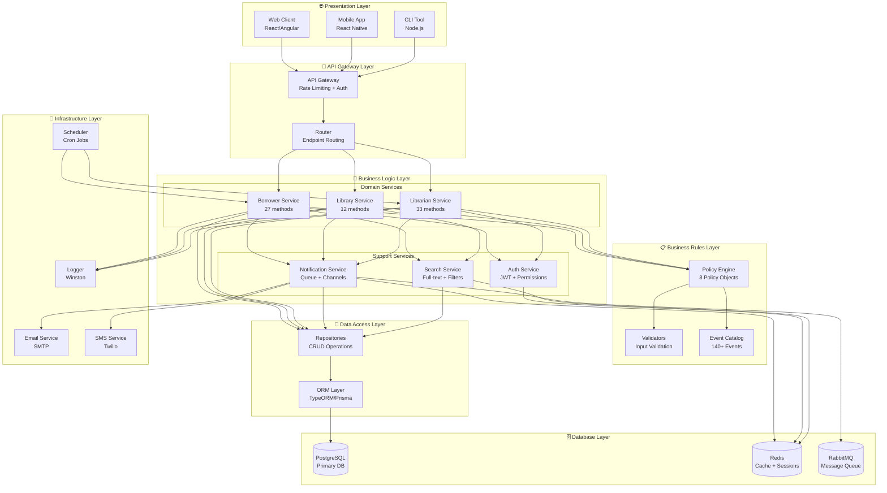

# 🏗️ System Architecture Diagram

[← Retour UML](README.md) | [← Notification Flow](05-notification-flow.md)

---

## Architecture Globale du Système

Ce diagramme illustre l'architecture complète avec ses couches et composants.



---

## 📦 Détails des Composants

### 🌐 Presentation Layer

#### Web Client
**Technologie**: React 18 / Angular 16  
**Responsabilités**:
- Interface utilisateur complète (emprunt, recherche, commentaires)
- Gestion état local (Redux/NgRx)
- Notifications en temps réel (WebSockets)
- Responsive design (mobile-first)

**Endpoints principaux**:
```
GET /api/books/search
POST /api/borrowings/create
GET /api/user/profile
POST /api/comments/add
```

---

#### Mobile App
**Technologie**: React Native / Flutter  
**Responsabilités**:
- Scanner codes-barres (ISBN)
- Notifications push
- Mode hors-ligne (cache local)
- Géolocalisation bibliothèque

---

#### CLI Tool
**Technologie**: Node.js + Commander.js  
**Responsabilités**:
- Administration système
- Import/export données
- Scripts maintenance
- Tests automatisés

**Commandes**:
```bash
library-cli import --file books.csv
library-cli export --type users --format json
library-cli stats --period monthly
```

---

### 🔌 API Gateway Layer

#### API Gateway
**Technologie**: Express.js / Fastify  
**Responsabilités**:
- Rate limiting (100 req/min par IP)
- Authentication (JWT validation)
- CORS policies
- Request logging

**Middlewares**:
```typescript
app.use(rateLimiter({ max: 100, window: '1m' }));
app.use(jwtAuth({ secret: JWT_SECRET }));
app.use(cors({ origin: ALLOWED_ORIGINS }));
app.use(requestLogger());
```

---

#### Router
**Responsabilités**:
- Route matching
- Parameter validation
- Error handling
- Response formatting

**Routes**:
```typescript
/api/v1/borrowings/*  → BorrowerService
/api/v1/library/*     → LibraryService
/api/v1/admin/*       → LibrarianService
/api/v1/search/*      → SearchService
```

---

### 💼 Business Logic Layer

#### Borrower Service (27 methods)
**Événements gérés**: 70+ events  
**Catégories**:
- Borrowing Operations (8 methods)
- Search & Discovery (6 methods)
- Comments & Ratings (5 methods)
- Notifications (4 methods)
- Profile Management (3 methods)
- Claims & Support (1 method)

**Méthodes principales**:
```typescript
borrowBook(userId, bookId): BorrowingRecord
returnBook(recordId): void
extendBorrowingPeriod(recordId, days): void
searchBooks(query, filters): Book[]
addComment(userId, bookId, rating, content): Comment
```

---

#### Library Service (12 methods)
**Événements gérés**: 30+ events  
**Responsabilités**:
- Gestion catalogue
- Statistiques système
- Recherche centralisée
- Coordination workflows

**Méthodes principales**:
```typescript
getAvailableBooks(category?): Book[]
getBookDetails(bookId): Book
getBorrowingHistory(bookId): BorrowingRecord[]
getSystemStatistics(): Statistics
```

---

#### Librarian Service (33 methods)
**Événements gérés**: 40+ events  
**Catégories**:
- Book Management (9 methods)
- User Management (7 methods)
- Communication (8 methods)
- Moderation (9 methods)

**Méthodes principales**:
```typescript
addBook(book: BookData): Book
updateBookStatus(bookId, status): void
suspendUser(userId, duration, reason): void
approveComment(commentId): void
generateReport(type, period): Report
```

---

#### Notification Service
**Responsabilités**:
- Queue prioritaire (URGENT > IMPORTANT > NORMAL)
- Multi-canal (In-App, Email, SMS)
- Templates dynamiques
- Batch processing

**Architecture**:
```typescript
class NotificationService {
  private queue: NotificationQueue;
  private channels: {
    inApp: InAppChannel;
    email: EmailChannel;
    sms: SMSChannel;
  };
  
  async send(notification: Notification): Promise<void> {
    this.queue.enqueue(notification);
    await this.processQueue();
  }
}
```

---

#### Search Service
**Responsabilités**:
- Full-text search (Elasticsearch)
- Filtres avancés (catégorie, auteur, disponibilité)
- Suggestions intelligentes
- Historique recherches

**Indexation**:
```typescript
interface BookIndex {
  id: string;
  title: string;        // Weighted: 3
  author: string;       // Weighted: 2
  description: string;  // Weighted: 1
  category: string;
  isAvailable: boolean;
  averageRating: number;
}
```

---

#### Auth Service
**Responsabilités**:
- Authentification JWT
- Gestion rôles/permissions
- Sessions Redis
- Refresh tokens

**JWT Payload**:
```typescript
interface JWTPayload {
  userId: string;
  username: string;
  role: 'user' | 'librarian' | 'admin';
  permissions: Permission[];
  iat: number;
  exp: number;
}
```

---

### 📋 Business Rules Layer

#### Policy Engine
**8 Policy Objects**:
1. `BORROWING_POLICIES` (9 rules)
2. `TIME_POLICIES` (7 rules)
3. `FEE_POLICIES` (8 rules)
4. `COMMENT_POLICIES` (6 rules)
5. `FLAG_POLICIES` (5 rules)
6. `SEARCH_POLICIES` (4 rules)
7. `NOTIFICATION_POLICIES` (6 rules)
8. `WORKFLOW_POLICIES` (8 rules)

**Utilisation**:
```typescript
if (user.borrowedBooks.length >= BORROWING_POLICIES.MAX_BOOKS_PER_USER) {
  throw new Error('Borrowing limit reached');
}
```

---

#### Event Catalog
**140+ Events** répartis en 14 catégories:
- Authentication Events (8)
- Book Borrowing Events (15)
- Book Return Events (10)
- Extension Events (8)
- Search Events (12)
- Comment Events (14)
- Flag & Moderation Events (10)
- Notification Events (12)
- Book Management Events (12)
- User Management Events (10)
- Admin Events (8)
- Claim Events (6)
- Report Events (8)
- System Events (7)

---

### 💾 Data Access Layer

#### Repositories
**Pattern**: Repository Pattern pour abstraction DB

```typescript
interface IBookRepository {
  findById(id: string): Promise<Book | null>;
  findAll(filters?: BookFilters): Promise<Book[]>;
  create(book: BookData): Promise<Book>;
  update(id: string, data: Partial<Book>): Promise<Book>;
  delete(id: string): Promise<void>;
}
```

---

#### ORM Layer
**Technologie**: TypeORM / Prisma  
**Responsabilités**:
- Mapping objet-relationnel
- Migrations automatiques
- Query builder
- Transactions

**Exemple Entity**:
```typescript
@Entity('books')
class Book {
  @PrimaryGeneratedColumn('uuid')
  id: string;
  
  @Column({ unique: true })
  ISBN: string;
  
  @Column()
  title: string;
  
  @OneToMany(() => BorrowingRecord, record => record.book)
  borrowingRecords: BorrowingRecord[];
}
```

---

### 🗄️ Database Layer

#### PostgreSQL (Primary DB)
**Tables principales**:
- `users` (1K rows)
- `books` (5K rows)
- `borrowing_records` (25K rows)
- `comments` (3K rows)
- `notifications` (50K rows)
- `audit_logs` (100K rows)

**Indexes**:
```sql
CREATE INDEX idx_borrowing_user_status ON borrowing_records(user_id, status);
CREATE INDEX idx_book_available ON books(is_available, category);
CREATE INDEX idx_notification_unread ON notifications(user_id, is_read);
```

---

#### Redis (Cache + Sessions)
**Utilisation**:
```typescript
// Cache recherches populaires (TTL: 1h)
cache.set(`search:${query}`, results, 3600);

// Sessions JWT (TTL: 24h)
cache.set(`session:${userId}`, token, 86400);

// Compteurs rate limiting (TTL: 1min)
cache.incr(`ratelimit:${ip}`, 60);
```

---

#### RabbitMQ (Message Queue)
**Queues**:
```
notifications.urgent    (priorité 10)
notifications.important (priorité 5)
notifications.normal    (priorité 1)
emails.batch           (async)
reports.generation     (async)
```

---

### 🔧 Infrastructure Layer

#### Logger (Winston)
**Niveaux**:
```typescript
logger.error('Critical error', { userId, error });
logger.warn('Rate limit exceeded', { ip });
logger.info('User logged in', { userId });
logger.debug('Cache miss', { key });
```

---

#### Scheduler (Cron Jobs)
**Tâches planifiées**:
```typescript
// Chaque jour à 8h: rappels échéance
cron.schedule('0 8 * * *', checkDueDateReminders);

// Chaque jour à minuit: détection retards
cron.schedule('0 0 * * *', detectOverdueBooks);

// Chaque dimanche: archivage notifications
cron.schedule('0 2 * * 0', archiveOldNotifications);

// Chaque mois: génération rapports
cron.schedule('0 0 1 * *', generateMonthlyReports);
```

---

## 🔄 Flux de Données Typiques

### Scénario: Emprunt de Livre

```
1. User → Web Client: Click "Emprunter"
2. Web Client → API Gateway: POST /api/borrowings/create
3. API Gateway → Auth Middleware: Validate JWT
4. Router → BorrowerService: borrowBook(userId, bookId)
5. BorrowerService → Policies: Check MAX_BOOKS_PER_USER
6. BorrowerService → Validators: Validate inputs
7. BorrowerService → Repository: Create BorrowingRecord
8. Repository → ORM: INSERT INTO borrowing_records
9. ORM → PostgreSQL: SQL execution
10. BorrowerService → NotificationService: Send confirmation
11. NotificationService → Queue: Enqueue notification
12. Queue → Mailer: Send email
13. BorrowerService → Logger: Log event
14. BorrowerService → Events: Trigger BORROWING_CREATED
15. API Gateway → Web Client: Return 201 Created
```

**Temps total**: ~250ms

---

## 📊 Métriques de Performance

| Opération | Temps Moyen | Temps Max | Throughput |
|-----------|-------------|-----------|------------|
| Search Books | 50ms | 200ms | 100 req/s |
| Borrow Book | 120ms | 500ms | 50 req/s |
| Return Book | 200ms | 800ms | 40 req/s |
| Add Comment | 80ms | 300ms | 80 req/s |
| Get Notifications | 30ms | 100ms | 200 req/s |

---

## 🚀 Scalabilité

### Horizontal Scaling
```yaml
# Load balancer
nginx:
  instances: 3
  round_robin: true

# API instances
api:
  instances: 5
  auto_scale: true
  min: 3
  max: 10

# Database
postgres:
  primary: 1
  replicas: 2
  read_write_split: true
```

### Caching Strategy
```
Level 1: In-memory (Node.js) - 100ms TTL
Level 2: Redis - 1h TTL
Level 3: PostgreSQL - Source of truth
```

---

[← Notification Flow](05-notification-flow.md) | [Retour UML](README.md)
